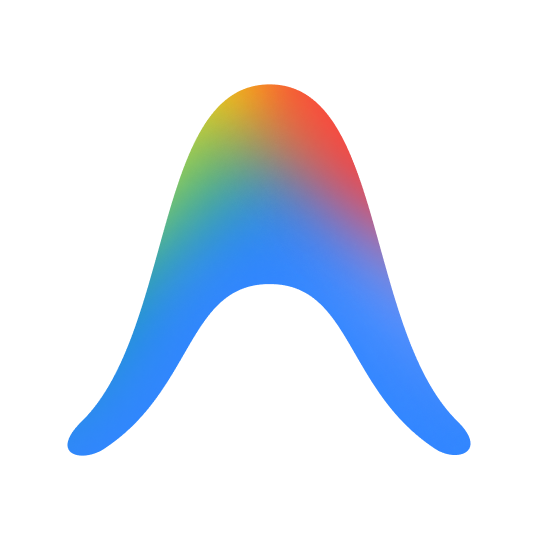

<div align="center">



# Open Gravity

**Universal local AI Proxy & interactive TUI bridging your Google Antigravity models to Claude Code, Codex, Aider, Cursor, and any agent.**

[](https://nodejs.org)
[](https://www.typescriptlang.org/)
[](LICENSE)
[](https://antigravity.google)
[](https://docs.anthropic.com/en/docs/agents-and-tools/claude-code/overview)
[](https://platform.openai.com)

</div>

---

## What is Open Gravity?

If you have a **Google AI Pro / Antigravity** subscription, you have access to Google's flagship reasoning models (**Gemini 3.7 Flash High**, **Gemini Pro Agent**, **Claude Sonnet**, **GPT-OSS 120B**).

However, external tools like Anthropic's **Claude Code CLI (`claude`)**, **Codex**, **Aider**, or **Cursor IDE** usually require separate pay-per-token API keys.

**Open Gravity bridges this gap**: it runs locally in your terminal, auto-detects your active Antigravity session, and serves standard Anthropic and OpenAI API endpoints. All requests from your external tools are executed through your Google Pro subscription with zero additional API costs.

> [!IMPORTANT]
> **Keep Antigravity open in the background.**  
> Open Gravity connects to Antigravity's local language server daemon, using your authenticated Google account and Pro tier quota. Zero extra API keys needed.

---

## Features

- **Interactive Terminal TUI**: Type runtime commands (`configure`, `status`, `models`, `doctor`, `clear`) directly into the running server without stopping it.
- **Automatic IDE Auto-Configuration**: Run `configure` or `open-gravity configure` to automatically write and update config files for Cursor, Continue.dev, Aider, and Claude Code.
- **Dual API Emulation**: Concurrently serves Anthropic Messages (`/v1/messages`) and OpenAI Chat Completions (`/v1/chat/completions`).
- **Real-Time Token Streaming**: Full Server-Sent Events (SSE) streaming support.
- **28+ Models Available**: Instant access to `gemini-3.7-flash-high`, `gemini-pro-agent`, `claude-sonnet-4-6`, `claude-opus-4-6-thinking`, `gpt-oss-120b-medium`, etc.
- **Account & Quota Visibility**: Detects your authenticated Google account (`name` / `email`), active plan, and remaining model quota with reset times.

---

## Quick Start

### 1. Installation

```bash
git clone https://github.com/limoonsdev/Open-Gravity.git
cd Open-Gravity
npm install
npm run build
```

### 2. Auto-Configure Your Tools

Run the 1-click configurator to automatically configure all your installed IDEs and CLIs:

```bash
node dist/index.js configure
```

This automatically configures:
- **Cursor IDE**: sets custom models and points the OpenAI Base URL to Open Gravity.
- **Continue.dev**: adds Antigravity models to `~/.continue/config.json`.
- **Aider**: creates `.aider.conf.yml` with `gemini-3.7-flash-high`.
- **Claude Code**: creates global `claude-og` launcher script with `ANTHROPIC_BASE_URL`.

### 3. Start the Server & Interactive TUI

```bash
npm start
# Or with options:
node dist/index.js start --port 8080
```

---

## Interactive Runtime TUI Commands

While Open Gravity is running and serving requests, you can interact with it in real time:

| Command / Hotkey | Description |
|---|---|
| `configure` / `c` | Re-run auto-configuration for Cursor, Continue, Aider, Claude Code |
| `status` / `s` | Refresh and display live Google account info and model quota |
| `models` / `m` | List available Antigravity models and context limits |
| `doctor` / `d` | Run live health checks on Antigravity daemon and RPC connection |
| `clear` / `cls` | Clear terminal screen and redraw status header |
| `quit` / `q` | Cleanly stop the server and exit |

---

## Manual Agent Setup

If you prefer to configure tools manually via environment variables:

### 🟣 Claude Code CLI (`claude`)

**Windows PowerShell:**
```powershell
$env:ANTHROPIC_BASE_URL = "http://127.0.0.1:8080"
$env:ANTHROPIC_API_KEY = "gravity-bridge"
claude
```

**Linux / macOS / Bash:**
```bash
export ANTHROPIC_BASE_URL="http://127.0.0.1:8080"
export ANTHROPIC_API_KEY="gravity-bridge"
claude
```

---

### 🟢 Codex CLI & Python OpenAI SDK

**Windows PowerShell:**
```powershell
$env:OPENAI_BASE_URL = "http://127.0.0.1:8080/v1"
$env:OPENAI_API_KEY = "gravity-bridge"
codex
```

**Python SDK:**
```python
from openai import OpenAI

client = OpenAI(
    base_url="http://127.0.0.1:8080/v1",
    api_key="gravity-bridge"
)

response = client.chat.completions.create(
    model="gemini-3.7-flash-high",
    messages=[{"role": "user", "content": "Write a quicksort in Rust."}],
    stream=True
)

for chunk in response:
    if chunk.choices[0].delta.content:
        print(chunk.choices[0].delta.content, end="", flush=True)
```

---

### ⚡ Aider CLI

```bash
aider --openai-api-base http://127.0.0.1:8080/v1 \
      --openai-api-key gravity-bridge \
      --model openai/gemini-3.7-flash-high
```

---

### 💻 Cursor IDE

In **Cursor Settings > Models > OpenAI API Key**:
- **Override OpenAI Base URL**: `http://127.0.0.1:8080/v1`
- **API Key**: `gravity-bridge`
- **Models**: `gemini-3.7-flash-high`, `claude-sonnet-4-6`, `gemini-pro-agent`

---

## Security

- **100% Local Loopback**: All proxy traffic stays on `127.0.0.1`.
- **Local CSRF Validation**: Communicates directly with your local Antigravity Language Server daemon.

---

## License

MIT License © Alexis & Open Gravity Contributors
