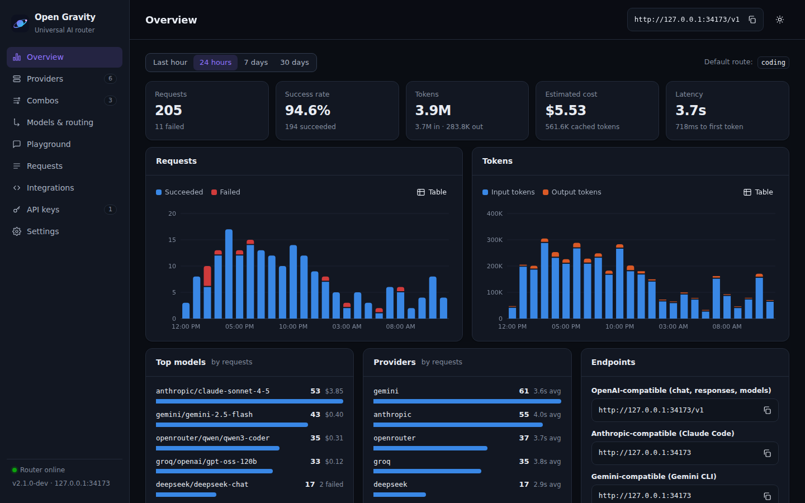
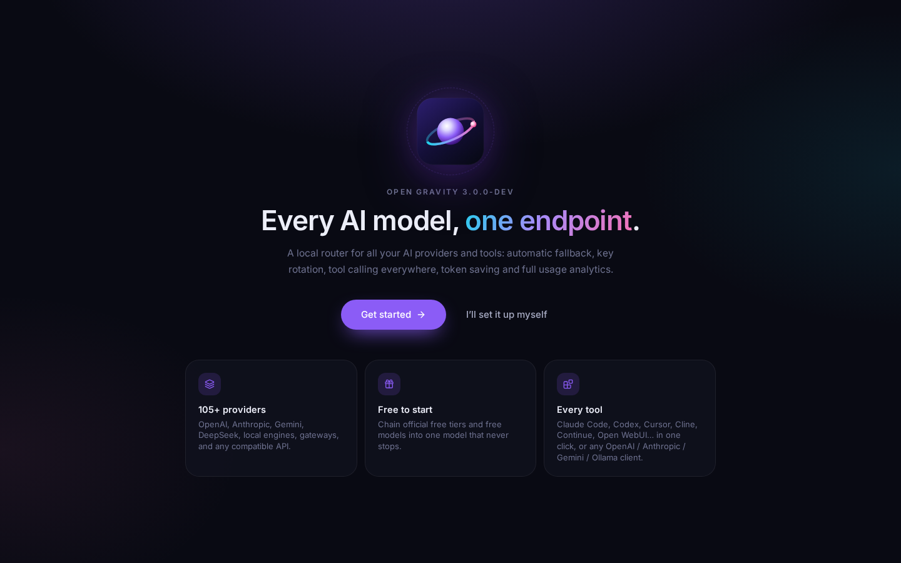
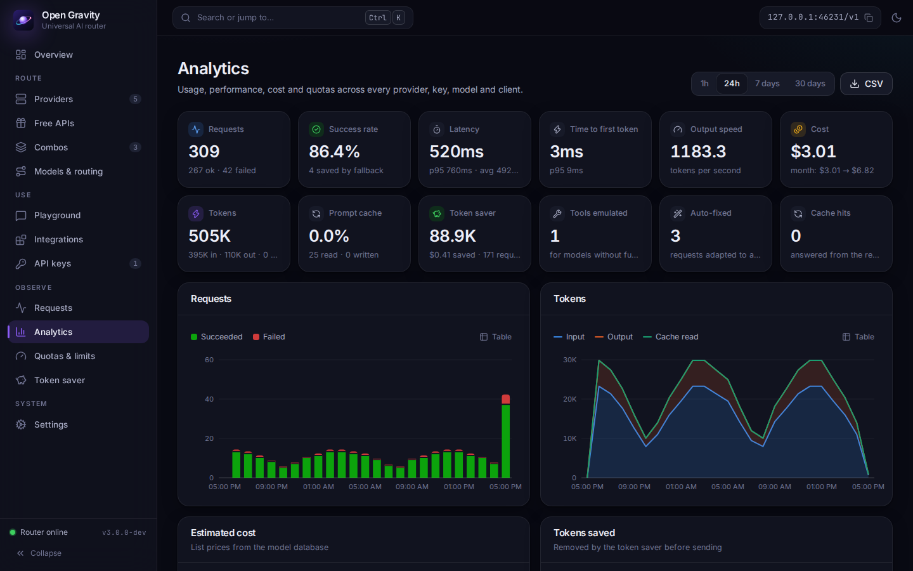
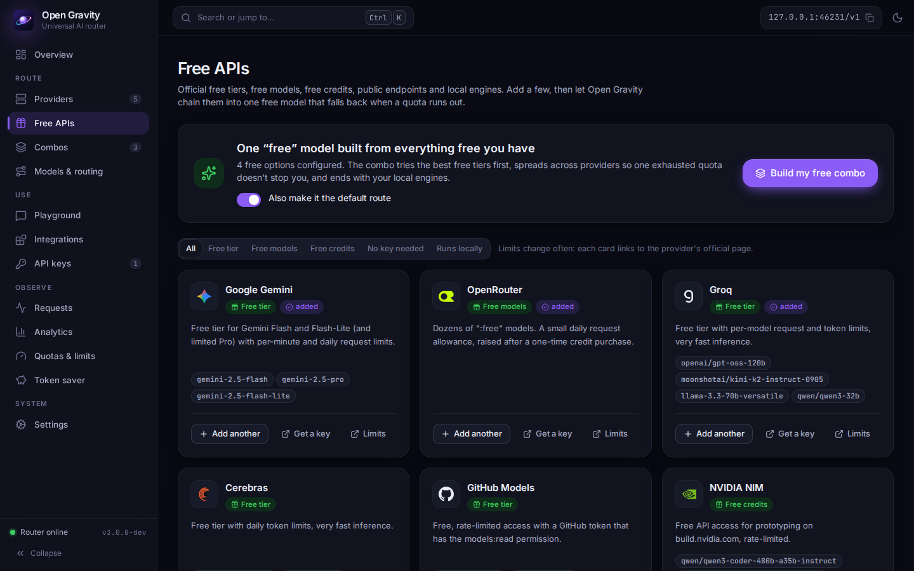
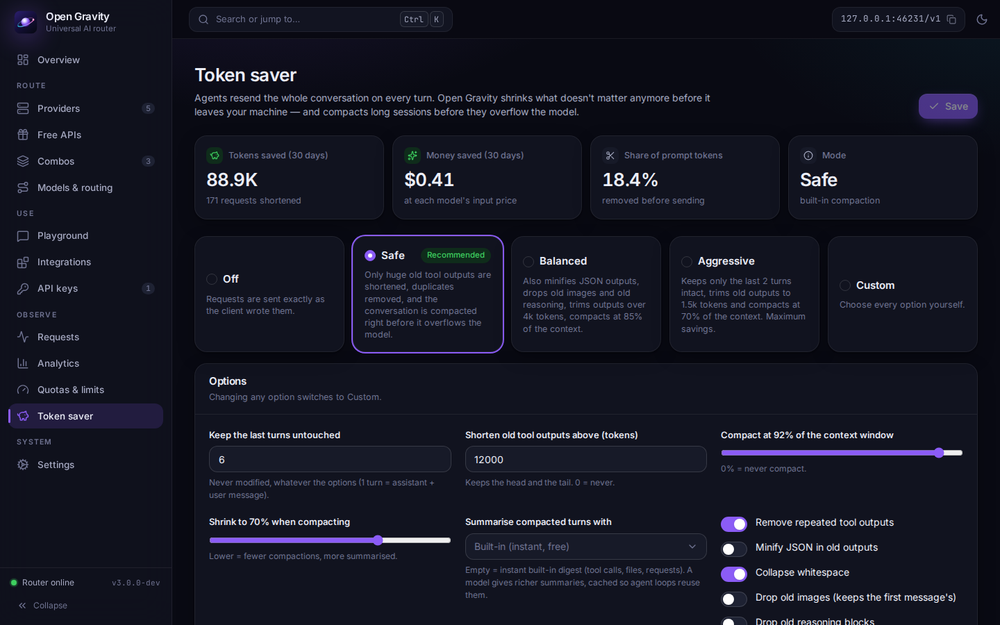
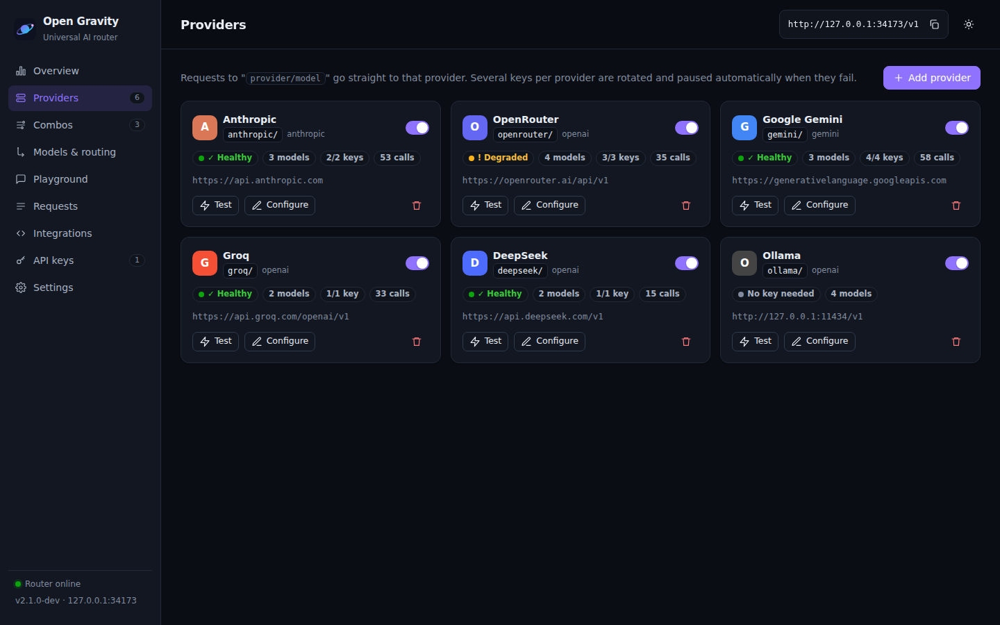
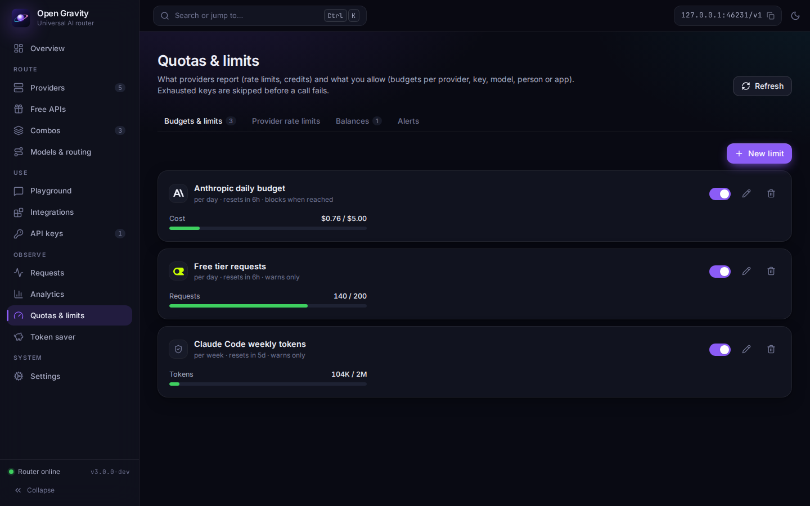
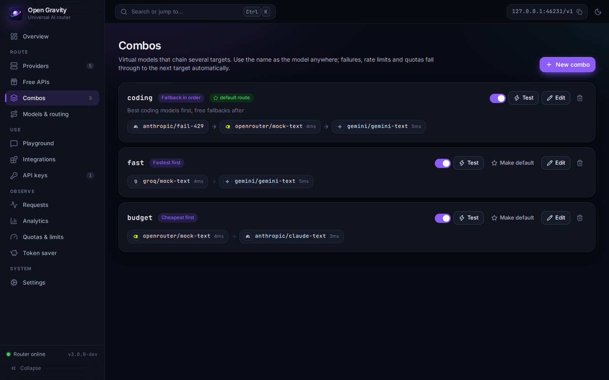
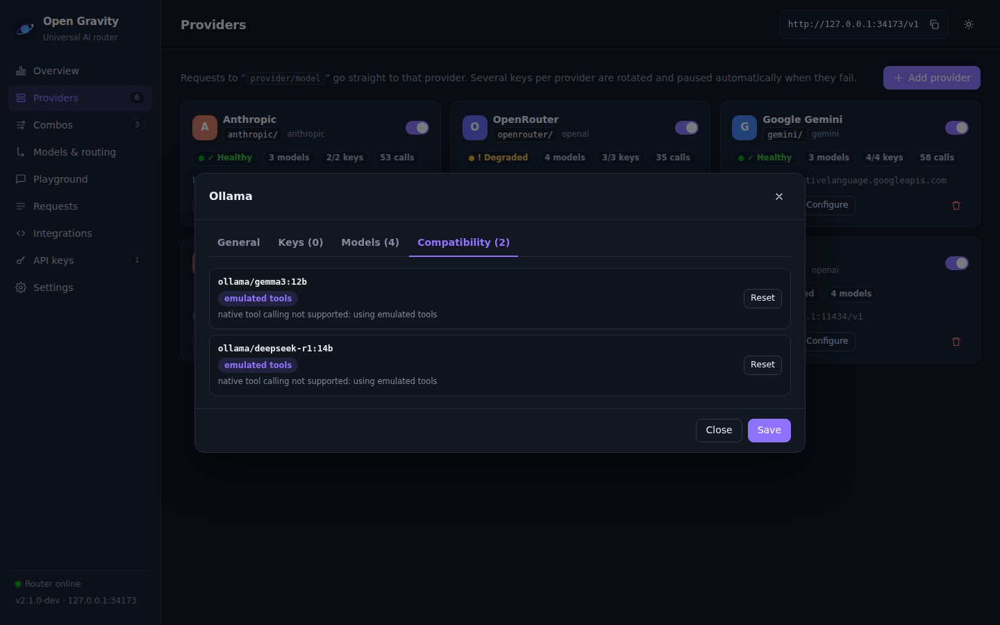

<div align="center">


# Open Gravity

**One local endpoint for every AI model you use.**
A universal AI router and desktop app: 105 provider presets, a free-API hub, automatic tool calling for any model, self-healing compatibility, fallback combos, multi-key rotation, a token saver, quotas and full usage analytics, in **one file**.

[](https://github.com/limoonsdev/Open-Gravity/actions/workflows/build.yml)
[](LICENSE)


[🇫🇷 Guide en français](docs/GUIDE-FR.md) · [Architecture](docs/ARCHITECTURE.md) · [Changelog](CHANGELOG.md)



</div>

---

Point **Claude Code, Codex, Gemini CLI, Cursor, Cline, Roo, Kilo, Continue, Zed, JetBrains AI, Xcode, VS Code Copilot, Open WebUI, LobeChat, n8n** or any OpenAI / Anthropic / Gemini / Ollama / LM Studio / Azure SDK at `http://127.0.0.1:18080` and route every request to **OpenAI, Anthropic, Google Gemini, Azure, Bedrock, Vertex, OpenRouter, Groq, DeepSeek, xAI, Mistral, Z.ai GLM, Kimi, MiniMax, Qwen, Cerebras, SambaNova, Together, Fireworks, NVIDIA, Cloudflare, Hugging Face, SiliconFlow, Volcengine, Ollama, LM Studio, vLLM, llama.cpp** and many more: **105 built-in presets** (cloud APIs, gateways, Chinese providers, 17 local engines), a **database of 3,500+ models** (context windows, tool support, prices), and any OpenAI-, Anthropic-, Gemini- or Responses-compatible endpoint.

Each client keeps speaking its own protocol. Open Gravity translates **OpenAI Chat Completions ⇄ Anthropic Messages ⇄ OpenAI Responses ⇄ Gemini generateContent ⇄ Ollama ⇄ Completions / FIM autocomplete** on the fly, including streaming, tool calls, reasoning/thinking and images. So Claude Code can run on Gemini, Codex on Claude, Cursor-style autocomplete on DeepSeek, and Gemini CLI on a local Ollama model.

## What's new in 3.0

| | |
|---|---|
| **Desktop app, one file** | `OpenGravity.exe` is a native Tauri app (tray icon, rounded frameless window on Windows 11, start with the computer, close to tray) that **embeds the whole router**: no Node, no installer, nothing else to download. Installers (NSIS, .deb, AppImage, .dmg) are built too. |
| **New dashboard** | Rewritten in Next.js + React + Tailwind: command palette (Ctrl+K), light/dark themes, live requests, provider logos, keyboard- and screen-reader-friendly charts with table views. |
| **Get started** | A guided first run: detects Ollama / LM Studio / llama.cpp / vLLM / Jan running on your machine, one-click free providers, builds your default route, connects your tools, sends a test message. |
| **Free APIs hub** | Every official free tier, free model, free credit and no-key public endpoint in one page, OpenRouter's current `:free` models discovered live, and a one-click **`free` combo** that chains them all and moves on when a quota runs out. |
| **Token saver & compaction** | Shrinks what agents resend on every turn (huge old tool outputs, duplicates, JSON, whitespace, old images and reasoning) and compacts long sessions *before* they overflow the context window, prompt-cache friendly. Presets, fine-grained options, a simulator and a monthly savings calculator. |
| **Quotas & budgets** | Rate limits read from provider headers (exhausted keys are skipped *before* a call fails), budgets per provider / key / model / router key / app (requests, tokens or dollars per minute → month, block or warn), 80 % / 100 % alerts, account balances (OpenRouter, DeepSeek, Kimi, SiliconFlow, one-api). |
| **Full analytics** | Latency p50/p95, time to first token, output speed, prompt-cache ratio, fallbacks, emulated tools, auto-fixes, by model / provider / key / client app / router key / endpoint / combo, weekday × hour heatmap, month projection, CSV export. |
| **Every IDE, even unknown ones** | Client apps are recognised automatically; Azure deployment paths, LM Studio `/api/v0`, Gemini's `/v1beta/openai`, DeepSeek `/beta`, `POST /` with protocol sniffing, images / audio / embeddings / rerank passthrough, and **FIM autocomplete** (native Codestral / DeepSeek / Ollama / llama.cpp `/infill`, emulated on every chat model). 41 integrations with installation detection. |

 
 

## Features

| | |
|---|---|
| **Universal translation** | 7 client protocols × 4 upstream protocols, streaming, tool calls, thinking, images, JSON mode. Same-protocol requests are passed through untouched for perfect fidelity. |
| **Automatic tool calling** | Models without function calling get emulated tools, detected automatically (model database, or the provider's error) and remembered. Tool arguments from any model are repaired (broken JSON, wrong types, wrong tool-name casing) and `<think>` tags become real reasoning blocks. |
| **Self-healing compatibility** | When a provider rejects a request because of a feature it doesn't support (tools, `tool_choice`, `stream_options`, `max_tokens` too large or renamed, context overflow, sampling parameters, system role, images, JSON mode, reasoning, FIM, unknown fields…), the request is fixed and retried at once, and the fix is remembered for that model. |
| **Model database** | 3,500+ models with context window, max output, tool/vision/reasoning support and prices (compiled from the MIT-licensed LiteLLM catalog, refreshed weekly). |
| **Combos** | Virtual models that chain several targets: `coding = claude-sonnet → qwen3-coder → gemini-2.5-pro`. Fallback, round-robin, random, **fastest** (measured time to first token), **cheapest** (model prices) or **race** (two targets at once, first answer wins). |
| **Resilience** | Automatic fallback on 429/5xx/auth errors/timeouts, even when the provider fails *inside* the stream; keys exhausted according to rate-limit headers are skipped proactively. |
| **Multi-account** | Several API keys per provider with round-robin or fill-first rotation, paused per model on rate limits and as a whole on auth errors. |
| **Aliases** | Rename or redirect any model name, with wildcards: `claude-*haiku*` → `fast`. Unknown names can fall back to your default route. |
| **Performance** | Streaming with no buffering after the first token, keep-alive pools, optional response cache, V8 code cache for a ~0.1 s cold start, Brotli-compressed dashboard served from memory. |
| **Integrations** | 41 tools, detected when installed. Claude Code, Codex, OpenCode, Gemini CLI, Qwen Code and Aider are configured in one click (with backup/restore); Continue, Cline, Roo, Kilo, Zed, Cursor, JetBrains AI, Xcode, Neovim, Emacs, Open WebUI, LobeChat, n8n, LangChain and the others get a ready-to-paste setup. |
| **Ollama-compatible** | Speaks the Ollama API (`/api/chat`, `/api/generate`, `/api/tags`, `/api/show`), so every app that supports Ollama can use any cloud model. |
| **Launchers** | `open-gravity claude` / `open-gravity codex` start those tools already wired to the router. |
| **Secure by default** | Listens on localhost; remote clients and web pages need a router API key; optional dashboard password; CSRF, DNS-rebinding and CSP protection; provider keys never reach the browser. |
| **Antigravity bridge** | The original Open Gravity feature lives on as a provider: use the Google Antigravity desktop app running on your machine. |

## Quick start

### 1. Get it

**Desktop app (recommended)**: download `OpenGravity-win-x64.exe` (or `OpenGravity-linux-x64` / `OpenGravity-macos-arm64`, or an installer) from the [Releases](https://github.com/limoonsdev/Open-Gravity/releases) page or the artifacts of the latest [Build workflow run](https://github.com/limoonsdev/Open-Gravity/actions/workflows/build.yml). Double-click it: the router starts inside the app and the *Get started* guide opens. Closing the window keeps the router running in the tray.

**Command-line version**: `open-gravity-win-x64.exe` (or `open-gravity-linux-x64`, `open-gravity-macos-arm64`) is the router alone, with the dashboard in your browser. Handy on servers and in Docker.

> Windows SmartScreen may warn about an unsigned app: *More info → Run anyway*. The desktop app uses Microsoft Edge WebView2, preinstalled on Windows 10/11.
> macOS: `xattr -d com.apple.quarantine OpenGravity-macos-arm64 && chmod +x OpenGravity-macos-arm64`.

**From source** (Node.js 20.12+):

```bash
git clone https://github.com/limoonsdev/Open-Gravity.git
cd Open-Gravity
npm install
npm start            # builds the dashboard and starts the router
```

### 2. Get started

The guide opens on first run (also in the command palette, Ctrl+K → *Get started*):

1. **Providers**: local engines already running are detected and added in one click; free tiers (Gemini, Groq, OpenRouter, Cerebras, GitHub Models, Mistral, NVIDIA, Pollinations…) and popular APIs just need a key.
2. **Route**: the `free` combo, a fallback chain over all your providers, or a single model becomes your default.
3. **Tools**: Claude Code, Codex, OpenCode, Gemini CLI, Qwen Code and Aider are configured in one click; everything else uses the universal endpoints.

### 3. Connect your tools

*Integrations* → *Configure automatically*, or:

```bash
open-gravity claude          # Claude Code through the router
open-gravity codex           # Codex CLI through the router
```

 
 

## Free APIs

*Free APIs* lists what each provider gives for free, with a link to its official limits page (limits change often, so numbers are not hard-coded):

| Kind | Providers |
|---|---|
| Free tier | Google Gemini (AI Studio), Groq, Cerebras, GitHub Models, Mistral (Experiment plan), Cloudflare Workers AI, Cohere (trial), Ollama Cloud, ModelScope |
| Free models | OpenRouter `:free` models (discovered live), Z.ai GLM-4.5-Flash, Zhipu GLM-4-Flash, SiliconFlow, Baidu ERNIE Speed/Lite, Tencent Hunyuan-lite, iFlytek Spark Lite, OpenCode Zen |
| Free credits | NVIDIA NIM, SambaNova, Vercel AI Gateway, Hugging Face, Scaleway |
| No key needed | Pollinations, LLM7, OVHcloud AI Endpoints (rate-limited public APIs) |
| Runs locally | Ollama, LM Studio, llama.cpp, vLLM, Jan… (free and private, needs a capable machine) |

*Build my free combo* chains everything free you added into one `free` model: the best free tiers first, spread across providers so one exhausted quota does not stop you, local engines last. Only official offers and intentionally public endpoints are used: Open Gravity does not scrape private endpoints or resell other people's quotas.

## Token saver

Agents resend the whole conversation on every turn. The token saver works on the request before it leaves your machine:

| Stage | What it does |
|---|---|
| Trim | Old tool outputs above a size are shortened (head + tail kept), repeated outputs deduplicated, JSON minified, whitespace collapsed, old images and reasoning dropped |
| Compact | When a conversation reaches a share of the model's context window (learned from the model database or from overflow errors), older turns are replaced by a digest (instant, built in) or a summary written by a model of your choice (cached, so agent loops reuse it) |

Recent turns, the system prompt and the task are never touched, and changes happen in steps of 8 messages so providers' prompt caches keep hitting. Presets: *Off*, *Safe* (default), *Balanced*, *Aggressive*, or *Custom*. The page has a simulator (run every preset on a real captured request) and a monthly savings calculator.

## Connecting clients

| Client | Base URL | Notes |
|---|---|---|
| **Claude Code** | `http://127.0.0.1:18080` | `ANTHROPIC_BASE_URL` + `ANTHROPIC_AUTH_TOKEN`, or `open-gravity claude` |
| **Codex CLI** | `http://127.0.0.1:18080/v1` | `wire_api = "responses"`, or `open-gravity codex` |
| **Gemini CLI** | `http://127.0.0.1:18080` | `GOOGLE_GEMINI_BASE_URL` + `GEMINI_API_KEY` in `~/.gemini/.env` |
| **OpenCode** | `http://127.0.0.1:18080/v1` | `@ai-sdk/openai-compatible` provider |
| **Cline / Roo / Kilo** | `http://127.0.0.1:18080/v1` | "OpenAI Compatible" provider (or Anthropic with a custom base URL) |
| **Aider, Continue, Zed, Qwen Code, Crush, Goose** | `http://127.0.0.1:18080/v1` | OpenAI-compatible settings |
| **Autocomplete** (Continue, Twinny, llama.vim…) | `http://127.0.0.1:18080/v1` | FIM: `/v1/completions` with `suffix`, `/v1/fim/completions`, `/infill` or Ollama `/api/generate`; native on Codestral / DeepSeek / Ollama / llama.cpp, emulated on any chat model |
| **JetBrains AI, Xcode, Android Studio** | `http://127.0.0.1:18080/v1` | "OpenAI-compatible" / "Locally hosted" provider (LM Studio `/api/v0` works too) |
| **Cursor** | public URL + `/v1` | Cursor calls custom endpoints from its servers: expose the router through a tunnel and use an API key |
| **VS Code Copilot Chat** | `http://127.0.0.1:18080` | "Manage Models" → Ollama; the router answers as an Ollama server |
| **Open WebUI, Msty, any Ollama app** | `http://127.0.0.1:18080` | Ollama API URL |
| **OpenAI SDK** | `http://127.0.0.1:18080/v1` | any language |
| **Anthropic SDK** | `http://127.0.0.1:18080` | any language |
| **Google GenAI SDK** | `http://127.0.0.1:18080` | `http_options={"base_url": ...}` (the `/v1beta/openai` flavour works too) |
| **Azure OpenAI SDK** | `http://127.0.0.1:18080` | as the Azure endpoint; the deployment name is the model |
| **Anything else** | `http://127.0.0.1:18080` | `POST /` is accepted and the protocol is detected from the body; unknown OpenAI sub-APIs (images, audio, rerank…) are forwarded |

When no router API key is required (the default for local use), any key value is accepted.

<details>
<summary>Claude Code: manual setup</summary>

```bash
export ANTHROPIC_BASE_URL=http://127.0.0.1:18080
export ANTHROPIC_AUTH_TOKEN=open-gravity           # or a router key
export ANTHROPIC_MODEL=coding                      # a combo, provider/model, or alias
export ANTHROPIC_DEFAULT_HAIKU_MODEL=fast          # used for background tasks
claude
```

Claude Code warns that it doesn't know the context window of custom model names; set `CLAUDE_CODE_MAX_CONTEXT_TOKENS` if your model has a larger window than 200k.
</details>

<details>
<summary>Codex CLI: ~/.codex/config.toml</summary>

```toml
model = "coding"
model_provider = "open-gravity"

[model_providers.open-gravity]
name = "Open Gravity"
base_url = "http://127.0.0.1:18080/v1"
wire_api = "responses"
```
</details>

## Model names and routing

A request's `model` is resolved in this order:

1. **Alias**: exact or wildcard (`claude-*haiku*`), pointing to anything below.
2. **Combo**: a named list of targets tried according to its strategy.
3. **`provider/model`**: explicit, e.g. `openrouter/qwen/qwen3-coder`, `gemini/gemini-2.5-pro`, `ollama/llama3.1:8b`.
4. **Bare model id**: every enabled provider that lists this exact model.
5. **Default route**: for empty names, `auto`, or (if enabled) unknown names.

The *Route tester* in the dashboard shows exactly which targets a name resolves to.

### Fallback rules

| Upstream result | What happens |
|---|---|
| 429 rate limit | That key + model is paused (`Retry-After`, or 60 s); next key, then next target |
| 401 / 402 / 403 | The key is paused for 10 min; next key |
| 5xx, timeout, network error | Key + model paused for 20 s; next key |
| 400 / 422 caused by an unsupported feature | Request fixed (e.g. tools emulated, parameter dropped, output capped) and retried on the same target; the fix is remembered |
| 400 / 404 / 413 / 422 (other) | Next target (the request may suit another model better) |
| Error inside the stream before any content | Treated like a 5xx: falls back transparently |
| Error after content was streamed | Reported to the client in its own protocol |

Up to 6 attempts per request by default (configurable), across keys and targets. Learned fixes are listed (and can be reset) in *Settings* and in each provider's *Compatibility* tab.

## API endpoints

| Protocol | Endpoints |
|---|---|
| OpenAI | `POST /v1/chat/completions`, `POST /v1/responses`, `GET /v1/models`, `POST /v1/embeddings` |
| Anthropic | `POST /v1/messages`, `POST /v1/messages/count_tokens`, `GET /v1/models` (with `anthropic-version`) |
| Gemini | `POST /v1beta/models/{model}:generateContent`, `:streamGenerateContent`, `:countTokens`, `GET /v1beta/models` |
| Ollama | `POST /api/chat`, `POST /api/generate`, `POST /api/show`, `GET /api/tags`, `GET /api/ps`, `GET /api/version` |
| Completions & FIM | `POST /v1/completions` (with `suffix` for fill-in-the-middle), `POST /v1/fim/completions` (Mistral), `POST /beta/completions` (DeepSeek), `POST /infill` (llama.cpp) |
| Azure OpenAI | `POST /openai/deployments/{deployment}/chat/completions` (and the other Azure paths) |
| Media & more | `/v1/embeddings`, `/v1/images/*`, `/v1/audio/*` (speech, transcriptions, translations), `/v1/moderations`, `/v1/rerank`: forwarded to a provider serving the model (multipart safe) |
| Misc | `GET /health`, `POST /` (protocol auto-detection) |

Paths without `/v1` (and with `/openai/v1`, `/anthropic/v1`, `/api/v1`, LM Studio `/api/v0`, Gemini `/v1beta/openai` prefixes) are accepted too. Responses carry `x-og-provider`, `x-og-model` and `x-og-request-id` headers (plus `x-og-emulated-tools` and `x-og-cache` when relevant).

## Providers

| Category | Built-in presets (105) |
|---|---|
| Popular | OpenAI, Anthropic, Google Gemini, OpenRouter, Groq, DeepSeek, xAI Grok, Mistral |
| Cloud & API | Azure OpenAI / AI Foundry, Amazon Bedrock, Google Vertex AI (express), Cloudflare Workers AI, Databricks, Cohere, AI21, Cerebras, SambaNova, Together, Fireworks, DeepInfra, NVIDIA NIM, GitHub Models, Hugging Face, Perplexity, Nebius, Novita, Hyperbolic, Featherless, Baseten, Friendli, Parasail, Nscale, Scaleway, OVHcloud, IONOS, Upstage, Reka, Inception, Nous, Morph, Kluster, Inference.net, Chutes, Venice, W&B Inference, GMI Cloud, Ollama Cloud, Sarvam, Pollinations, LLM7, Codestral, Z.ai (+ Coding Plan), Moonshot Kimi, MiniMax, Qwen, OpenAI Responses… |
| Gateways | Vercel AI Gateway, Requesty, AIHubMix, AI/ML API, Poe, OpenCode Zen, Portkey, LiteLLM proxy |
| China | Qwen (DashScope), Zhipu GLM, Kimi, Volcengine Ark (Doubao), Baidu Qianfan, Tencent Hunyuan, iFlytek Spark, StepFun, Baichuan, 01.AI Yi, SiliconFlow, ModelScope |
| Local engines | Ollama, LM Studio, llama.cpp, vLLM, SGLang, TGI, LocalAI, Jan, KoboldCpp, text-generation-webui, Xinference, GPT4All, Lemonade, Docker Model Runner, MLX, llamafile, Msty, Antigravity desktop app |
| Custom | Any OpenAI-, Anthropic-, Gemini- or Responses-compatible endpoint |

Each provider supports several keys, custom headers, a per-provider HTTP proxy and timeout, a tool-calling mode (auto / native / always emulate) and any authentication style (`Authorization: Bearer`, `x-api-key`, `api-key`, `x-goog-api-key`, a custom header with prefix, or none). Presets with URL variables (Azure resource, Cloudflare account, Bedrock region…) ask for them when you add the provider.

## Security

- The router listens on `127.0.0.1` by default. On `0.0.0.0`, requests from other machines must carry a router API key.
- Browser requests from other websites always need a key (a random web page can't spend your quota), and the Host header is checked against DNS rebinding.
- The dashboard API requires a same-origin custom header (CSRF-proof). Set a dashboard password to protect it, which is required for remote dashboard access.
- Provider keys are stored in `~/.open-gravity/config.json` (file mode 600) and are never sent back to the browser; the dashboard is served with a strict Content-Security-Policy.
- The desktop app only lets its window navigate to the local router; every other link opens in your browser.

## CLI

```
open-gravity [start] [--port 18080] [--host 127.0.0.1] [--no-open]
open-gravity start --desktop --parent-pid <pid>   (used by the desktop app)
open-gravity claude [args...]          launch Claude Code through the router
open-gravity codex [args...]           launch Codex CLI through the router
open-gravity setup [tool] [--model m]  configure claude-code | codex | opencode | gemini-cli | qwen-code | aider
open-gravity models                    list routable models
open-gravity key create [name]         create a router API key
open-gravity doctor                    check config and test every provider
open-gravity status                    is the router running?
```

While running, the console accepts `open`, `claude`, `codex`, `models`, `status`, `quit`. Starting a second instance just opens the dashboard of the running one.

Environment variables: `OPEN_GRAVITY_HOME` (data folder), `OG_PORT`, `OG_HOST`, `OG_NO_OPEN=1`, `OG_DEBUG=1`.

## Building

```bash
npm run check           # typecheck + tests + bundle (builds the dashboard if needed)
npm run build:ui        # Next.js dashboard -> dashboard/out (embedded in the bundle)
npm run dev:ui          # dashboard dev server with hot reload (proxies to a running router)
npm run exe             # command-line executable for this machine   -> release/
npm run exe:win         # Windows .exe (works from Linux/macOS too)
npm run exe:all         # win-x64, linux-x64, macos-arm64, macos-x64
npm run desktop         # desktop app, one file: release/OpenGravity-<platform>[.exe]
npm run desktop:bundle  # + installers (NSIS, .deb, AppImage, .dmg)
npm run smoke -- release/open-gravity-win-x64.exe
node scripts/smoke-desktop.mjs release/OpenGravity-win-x64.exe
```

The desktop app is a [Tauri 2](https://tauri.app) shell (Rust, the system WebView) that embeds the command-line executable gzip-compressed; on first launch it is extracted once per version to the app's data folder and started with `--desktop`, and it stops with the app. It needs Rust and, on Windows, the MSVC build tools (CI builds it on `windows-latest`); on Linux, `libwebkit2gtk-4.1-dev`, `libayatana-appindicator3-dev` and `librsvg2-dev`.

Executables are built with [Node.js Single Executable Applications](https://nodejs.org/api/single-executable-applications.html): the app is bundled by esbuild into one file, embedded in the official Node.js binary of the same version (downloaded and SHA-256-verified for other platforms). On Windows hosts the icon and version info are applied too. CI builds every platform on each push, and a `v*` tag publishes a GitHub release.

## Data

Everything lives in `~/.open-gravity/` (`%USERPROFILE%\.open-gravity` on Windows):

- `config.json`: providers, keys, combos, aliases, settings (edits are hot-reloaded)
- `usage/*.jsonl`: request history (retention configurable)
- `backups/`: previous tool configuration files, for *Restore*
- `cache/modeldb.json`: the latest model database (the executable also carries a built-in copy)

The desktop app keeps its own preferences (close to tray, autostart) and the extracted router in the system's app-data folder (`%LOCALAPPDATA%\com.opengravity.desktop` on Windows).

Open Gravity 1.x settings (`~/.gemini/gravity-bridge.json`, `GEMINI_API_KEY`) are imported on first start.

## FAQ

**Can I use my Claude Pro/Max, ChatGPT or Gemini subscription instead of API keys?**
Not directly. Open Gravity works with official API keys and compatible endpoints. The Antigravity provider bridges the Antigravity desktop app you are signed into on your own computer.

**Is anything sent to a third party?**
No. Requests go straight from your machine to the providers you configured. There is no telemetry.

**Can Open Gravity collect free API access from websites that expose models (by capturing their private requests)?**
No, and it won't. Using a site's private endpoints without permission breaks its terms, spends someone else's quota and usually stops working within days. The *Free APIs* page gathers what is legitimately free instead (official free tiers, free models and credits, intentionally public no-key APIs, local engines) and chains it into one `free` model.

**Does it really support "1000+ providers"?**
There are about a hundred distinct AI API services, and Open Gravity ships a preset for 105 of them. Everything else that speaks the OpenAI, Anthropic, Gemini, Responses or Ollama protocol (most inference servers, gateways and self-hosted engines do) works through a *Custom endpoint*, with the same fallback, key rotation, tool emulation and self-healing.

**My model has no tool calling. Can I use it with Claude Code or Codex?**
Yes. Leave *Tool calling* on *Auto*: if the model database says the model has no function calling, or if the provider rejects the `tools` field, Open Gravity switches to emulated tools and remembers it. You can also force *Always emulate* per provider. How well it works depends on the model following instructions; recent open models (Qwen, Llama 3.x, Mistral, DeepSeek, GLM…) handle it well.

**Where do the cost figures come from?**
From the model database (public list prices per provider), with a fallback table. They are estimates: free tiers, discounts and very new models may not be reflected. Local models count as free.

## License

MIT © Alexis & Open Gravity contributors

The model database (`src/data/models.json`) is derived from LiteLLM's `model_prices_and_context_window.json`, MIT License, Copyright (c) 2023 Berri AI.
